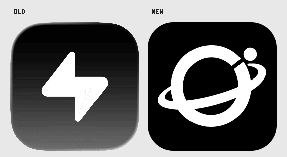
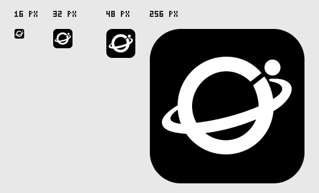
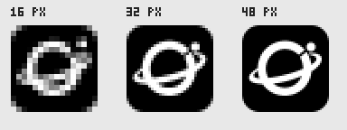
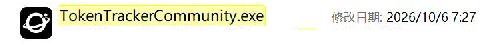
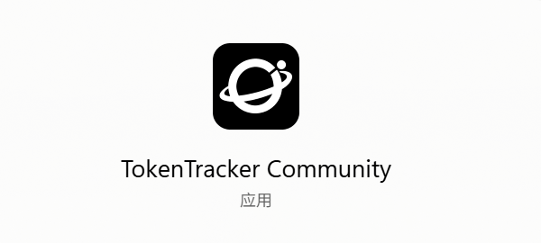
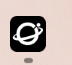
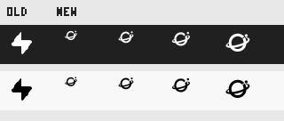

# Brand Icon Replacement Validation

## Scope and source

- Own repository: `baozibao728-cmd/TokenTracker-Community`; Draft PR #8, branch `codex/brand-orbit-icon`.
- Started from current own main `78f76216210cb9247465121821dbd0abf978057c`.
- Original candidate/package source and explicit checkout: `06a3284d9352e697267b141b545ca0bd765a0f8f`. The cache/tray follow-up at the end records a separate candidate and its evidence.
- Master: [app-icon.svg](../assets/brand/app-icon.svg); master SHA-256 `d6c5b81f32ee94b7ab63cf4ae347e7fc531bc0f5c5f1b81b3331f3cb303997d5`.
- Approved concept remains a reference only. Production resources omit its outer canvas and presentation shadow. The black tile, connected white ring/orbit, upper-right opening and satellite preserve the approved shape.
- 16–24 px renderings widen the same opening and move the satellite less than one pixel; 32 px and above follow the master directly. Separate-dot and connected-mark checks pass at 16/32/48 px.

## Visual review

The first size sheet copies actual pixels without scaling. The enlarged sheet uses nearest-neighbor to expose small-size separation. Manual image inspection confirms the opening, satellite and orbit remain recognizable; this is resource inspection, not native platform GUI acceptance.

## Original candidate resources and generation

| Area | Actual consumer / change |
|---|---|
| Web | Existing BrandLogo, sidebar, login/share marks use `app-icon.png`; regenerated favicon ICO/16/32, apple-touch 180, PWA 192/512; added previously referenced but absent `icon.svg`. No page behavior changed. |
| Windows | `assets/trayicon.ico` remains the exe/window/Inno icon input; 16/32/48/64/256 frames now share the new master. `make-icon.ps1` delegates to the shared generator. |
| macOS | Actual `AppIcon.icon/icon.json` references `02-orbit.svg`, removes old bolt layer and disables presentation shadow/translucency; full-bleed black layer uses Apple's native mask. Fallback ICNS and 1024 export regenerated. Static menu bar template uses black transparent 18/36 PNGs. Swift entry points preserve directed output arguments. |
| Linux | Dashboard 512 PNG still feeds the existing RGBA sync script and Tauri icon. Application and static tray use that same icon. |
| Static tray / pets | The original candidate kept both Windows static ICOs byte-identical and isolated their generator from the macOS static menu icon. Native inspection later established that these ICOs are lightning glyphs, not animated pets. Actual macOS animation frames and pet styles remained unchanged. |

`scripts/generate-brand-icons.cjs` uses existing pngjs, restricted closed-path rasterization and deterministic PNG/ICO/ICNS encoding. [Generated-resource manifest](../assets/brand/generated-manifest.json) records the 17 resources plus its own generated manifest (18 outputs total). No dependency upgrade. Narrow LF attributes prevent cross-platform SVG byte drift. Run `npm run gen:brand-icons`, `npm run validate:brand-icons`, then `node scripts/brand-icon-previews.cjs` for documentation previews.

## Original candidate local checks

- Generation, actual consumer, macOS asset/override and package/RC contracts: **20/20 PASS** (`node --test --test-isolation=none` on this Windows host).
- Linux icon sync: **6/6 PASS**, including indexed palette/transparency fixture and actual RGBA pixels.
- macOS independent identity guards: **3/3 PASS**.
- Windows original static tray regeneration: four frames per theme match existing decoded pixels; the two ICO files were unchanged in this candidate.
- Full 18-output generation `--check`, Windows generation wrapper, version check (1.2.0), secret/path scan and `git diff --check`: **PASS**.
- Local default child-process test isolation encountered Windows sandbox `spawn EPERM`; the same targeted tests completed with isolation disabled. Remote ordinary CI uses its normal runner and test command.
- Local machine has .NET 9 only; .NET 8 checks belong to the real Windows CI runner rather than local roll-forward.

## Boundaries and retained limits

Only icon resources, their generation chain, targeted tests and package verification change. Name, AppId/bundle ID, data/protocol, backend/updater, version, Community/Foundation/Parser/Cost/Provider behavior remain unchanged. Provider/function icons and pets are preserved. The two publish workflows and eight inherited workflows remain disabled; only ordinary CI and build-only RC run.

At completion of the original build/package review, no local installation had been performed and new-icon Windows GUI/runtime was NOT_TESTED; the subsequent authorized native check is recorded separately below. Windows isolated PE icon inspection remains separate evidence. No tag, Release, merge, cloud change or public asset replacement. macOS/Linux GUI/RUNTIME remain NOT_TESTED. Windows unsigned and macOS ad-hoc (no Developer ID/notarization) limitations remain. Existing complete Dashboard baseline failures, WSL/upgrade and metadata/config limits remain unchanged; no full business lifecycle was rerun for this image change.

## CI, artifacts and actual package evidence

**PASS** for the candidate source above; no package provenance is reassigned to a later documentation HEAD.

- [Ordinary CI](https://github.com/baozibao728-cmd/TokenTracker-Community/actions/runs/37429406370): **4/4 PASS** (test/validate/build, Linux Rust, macOS unit tests, Windows .NET 8 build/tests). PR source `06a3284d9352e697267b141b545ca0bd765a0f8f`; ordinary CI default merge checkout `e54f272099093c6a5c12b423c3774f2224278d7b` merges that candidate with own main `78f76216210cb9247465121821dbd0abf978057c`.
- [Build-only RC](https://github.com/baozibao728-cmd/TokenTracker-Community/actions/runs/37429406437): candidate, Windows, macOS, Linux and delivery **5/5 PASS**. All runners explicitly check out the exact candidate `06a3284d9352e697267b141b545ca0bd765a0f8f` and validate actual HEAD; no publish workflow is called.
- [Final delivery artifact 11396657946](https://github.com/baozibao728-cmd/TokenTracker-Community/actions/runs/37429406437/artifacts/11396657946), `community-rc-06a3284d9352e697267b141b545ca0bd765a0f8f`: 498,861,850-byte outer Actions ZIP; its downloaded SHA-256 `0a2f47076efba24daf37a60015d81b2ac55269b75048ae4b8eee1e36c651f45c` matches GitHub's artifact digest. This outer ZIP is separate from the six native package hashes below.
- Eight original files were extracted and retained; the six package bytes, SHA256SUMS, version/source/checkout and exact filename inventory were verified. Both metadata files' own hashes are recorded below.

| Package inspection | Actual evidence / result |
|---|---|
| Windows RC | ZIP-extracted and runner-installed exe plus actual Setup PE RT_GROUP_ICON/RT_ICON PNG payloads match the shared ICO at 16/32/48/64/256. All eight embedded web brand assets exact. Formal self-contained x64 payload and installer identity checks PASS. |
| Windows local download | In an isolated extraction directory, downloaded ZIP exe and original Setup PE resources independently match the five canonical icon frames. All eight extracted web resources match source bytes. No executable or installer was run locally. |
| macOS DMG | Both Swift entry points ran on macOS and their isolated outputs matched committed resources. Mounted DMG fallback ICNS matches canonical bytes; compiled Assets.car contains AppIcon (not a claim of decoded catalog pixel/GUI validation). Universal app/widget/Node, version/bundle/protocol and ad-hoc signature checks PASS; all eight embedded web resources exact. |
| Linux AppImage | Its own extracted 512x512 hicolor PNG pixels and all eight web resources match; runtime, version and protocol/identity checks PASS. |
| Linux deb | Its own independently extracted 512x512 hicolor PNG pixels and all eight web resources match; runtime, package metadata and protocol/identity checks PASS. |
| Linux rpm | Its own independently extracted 512x512 hicolor PNG pixels and all eight web resources match; runtime, package metadata and protocol/identity checks PASS. |

The hashes correspond to actual native package bytes, not an Actions outer ZIP. All six packages keep version **1.2.0**.

| Original filename | Architecture | Bytes | SHA-256 |
|---|---|---:|---|
| TokenTracker-Community-win-x64.zip | x86_64 | 114954278 | `b454883f4075262c1b5d6d84f80c31b1875be6cc92e7f6f61c06efe3f57ef307` |
| TokenTracker-Community-Setup.exe | x86_64 | 80795701 | `d6b0f6ea25c54302bbf4f31b0f38d5f6bca3a662866323f6cc9b0410a0e6fa87` |
| TokenTrackerCommunity.dmg | arm64+x86_64 | 61722358 | `9ce1b66bff29ed10e230faa08a3011e428f6d3f43377beee99596d37d8f8a334` |
| TokenTracker-Community-linux-x86_64.AppImage | x86_64 | 127453688 | `7002a02ca0c83a456ddb7525577aea913e0898c17e3251174cbd2f101c3afb83` |
| TokenTracker-Community-linux-x86_64.deb | x86_64 | 56980672 | `e2048bcf8febfd8793bc099ecaad0405f96591dc52763b6dcf52092c33afd872` |
| TokenTracker-Community-linux-x86_64.rpm | x86_64 | 56951704 | `73a8cc567f2e301864418e1fea45ab107cef5bb90e15e80dc5246fa292b5f904` |
| SHA256SUMS | metadata | 615 | `39841b7e8e76c9fd596040046bf34fa20243d6cc0e963aad7abcc0fd6f58057b` |
| RC_MANIFEST.json | metadata | 1598 | `2928799a98514c2a4b48abe8cb9240e40984781ad257016f62f79d0a4f333281` |

## Iterations and review boundary

The initial `d50e2dde2e62428c476a3bdc6cd7ef0dda1e45c7` [CI](https://github.com/baozibao728-cmd/TokenTracker-Community/actions/runs/37429117275) and [RC](https://github.com/baozibao728-cmd/TokenTracker-Community/actions/runs/37429117273) runs were cancelled by normal PR concurrency when the pet-source isolation fix was pushed. They are not the final acceptance or artifact source. The original pet binaries remain unchanged; only their future generator input was isolated. The final candidate had no CI/package failure and did not remove or relax existing gates.

The first local small-icon check exposed satellite/ring contact at 16 px. The documented sub-pixel spacing adjustment and final 16/32/48 regression resolve it. A local test initially used an incorrect Inno source filename; the test now targets the actual TokenTracker.iss consumer. These are retained implementation checks, not runtime failures.

The first single-connection artifact download was too slow. Parallel HTTP byte ranges and resumable retries were used; the assembled outer ZIP digest and all native package hashes passed. No package was rebuilt, repacked or resigned during download verification.

The report's later documentation-only commit is distinct from the tested package source. Its exact HEAD and subsequent ordinary CI status belong to the Draft PR validation summary, avoiding a self-recording commit loop. Documentation-only updates do not rebuild the three packages.

**Original build/package review: READY FOR REVIEW.** Draft PR remains unmerged. Native acceptance requested afterwards is recorded separately below. Public preview assets are untouched.

## Windows installed native icon acceptance — 2026-10-06

Status: **Observed Windows exe, Start-menu/search, taskbar/window and in-app branding PASS; the in-app result required targeted cache recovery. Desktop shortcut GUI confirmation remains NOT_TESTED. Retained static tray appearance is recorded accurately below for review.** No product source or package bytes changed for this check.

- Original Setup from artifact 11396657946: **80,795,701 bytes**, SHA-256 `d6b0f6ea25c54302bbf4f31b0f38d5f6bca3a662866323f6cc9b0410a0e6fa87`; independently rechecked before execution. Manifest source/checkout both `06a3284d9352e697267b141b545ca0bd765a0f8f`, version `1.2.0`.
- Community was stopped before backup. A restricted, current-user-only recovery copy of both Community native/WebView data and CLI data was verified against the immutable pre snapshot; all **1,183 native files and 20 CLI files** matched.
- Original installer performed an overlay installation with its existing optional Community desktop-shortcut task; exit code **0**. Installed exe product version `1.2.0+06a3284d9352e697267b141b545ca0bd765a0f8f`; exe SHA-256 `ddbe722bc64cc3a2ffbb05d892b0cd3580e390b3ad132da47d2799093987e9f0`. Exe and Node processes originate from the normal Community installation directory.
- Immediately after installation, before application launch, **all Community native/CLI file contents matched pre**, including account persistence and the disabled cloud-sync preference. The application data directories were not replaced by installation.
- Official installation files (1,760), protocol/uninstall identity and protected tool configurations matched pre. The already-running official process's data directory differed only in two usage-limits cache files; no other tracked official data changed. Writer attribution was not instrumented; the files are retained as runtime cache changes, not attributed to this installer.
- Start-menu and newly created desktop shortcuts target the installed Community exe and use its icon. No old Community process was running. Installed five-frame PE icon matches the canonical ICO; all eight installed web brand assets match source bytes. Both installed mascot ICOs match the preserved originals. No official shortcut, protocol or icon cache was modified.
- Explorer's actual exe display shows the new orbit mark. Screenshot below is a native capture cropped without rescaling to omit unrelated folders; the local path text is masked, leaving the icon pixels unchanged. It is not a generated preview. No global cache purge or Explorer restart was needed for this observed surface.

- User-supplied native screenshots subsequently confirm **Start-menu/search icon PASS**, **running window/taskbar icon PASS**, and the existing account still displayed on the functioning Dashboard. The window has an existing custom frameless title strip, with no separate painted caption icon; no new caption behavior was added. No old-symbol cache residue was observed on the exe, Start-menu or taskbar surfaces, so no cache reset was performed.

- **Tray clarification:** the hovered `TokenTracker Community` tray icon is still a lightning glyph. This is not a stale process/cache issue: the installed `tray-mascot-onLight.ico`/`onDark.ico` match the preserved source bytes, and the separate 36px `tray-mascot-source.png` itself contains a lightning silhouette. Although existing code/comments call these resources a mascot, that name is not evidence of a pet-shaped graphic. The fixed candidate deliberately preserved these resources; the earlier blanket description as a "pet tray" was inaccurate. Actual pet animation resources were not replaced. Review must distinguish retaining the existing tray appearance from replacing all static brand marks; this acceptance does not claim that the tray shows the new orbit. No resource was patched in place and no replacement package was generated.

- The user's narrow-window screenshot initially showed the **old in-app lightning mark**. The only running TokenTracker host was the installed Community exe, with its own Node child; that initial display was not accepted as a new-icon GUI PASS and was not attributed to an official window. A direct unauthenticated GET to that child's loopback `/app-icon.png` returned **HTTP 200** and SHA-256 `87a0aa8327171c9f75b67a304906cc72bd252b6363742b7c1c1cb542e5bb4d2c`, identical to the installed/source new icon. The response had `Cache-Control: public, max-age=31536000, immutable`, matching `src/lib/static-server.js`; the unchanged image URL could retain an old WebView image across overlay installation. A single current-page hard refresh was requested as the first minimal cache treatment. An on-disk/new HTTP resource alone was not treated as evidence that the rendered image had changed. The subsequent failure, cache evidence and recovery are recorded below.

### Follow-up — 2026-10-07

The user reported that the requested hard refresh still displayed the old lightning in the narrow Pets-page header. **Hard-refresh recovery FAIL** is retained; it is not a new-icon GUI PASS.

A read-only inspection of the Community Dashboard's HTTP cache identified the exact loopback `/app-icon.png` normal entry. Its PNG body is **3,310 bytes**, SHA-256 `5be9efa8ef3420e068d2bf0dd098c073b12777ffc9d74a6aee97ec4d31ea8d80`; the actual extracted image below is the old lightning. It differs from the new installed/HTTP image (`87a0aa83…e5bb4d2c`). Only this static resource body was extracted; no Cookie, authentication header, account storage or private API response was printed or copied into this report. The source and installed bundle both use `/app-icon.png` in `MobileTopBar`, without an inline old-logo or fallback path.

Chromium stores this entry in shared block files, rather than an independent image file. Removing its backing file alone would damage other cache entries. After Community exited, only the Community Dashboard HTTP `Cache_Data` directory was backed up into a unique, current-user-only quarantine and the copy was verified before clearing the original. **156 cache files / 21,133,964 bytes** were backed up, with stable file-inventory/content hash `a948768ebb29674da0f1ee8c8f9eb7a8f619b30716358e219e50423c307465a3`.

Immediately before/after this cache-only operation, all **1,047 non-HTTP-cache native files** matched (aggregate `c09ed2fe9d60f5591adb2242871d87e7441225707ab4f0994a34464e12f5a1ee`), and all **20 CLI files** matched (aggregate `679e7d0c6cc034f7401f8e94335f563258b7c6b67bbfa4be8655c031dafa6cef`). Cookies, Local/Session Storage, relay persistence, native settings and usage data were retained; cloud sync remained **false**. Only the explicit Community cache path was cleared; the official application and global Windows icon cache were not touched.

The same formally installed fixed RC was launched afterwards. The user confirmed "没问题了" and supplied the actual narrow-window Dashboard screenshot showing the **new orbit mark**. **In-app new-icon rendering PASS after cache recovery.** The crop below preserves the original screenshot pixels without rescaling; it is not a generated mockup. The installed Community exe and its own embedded Node were checked again after restart. Cloud-sync preference remained **false** and relay persistence was still present; no credential contents were read.

This is cache recovery for the original package, not a source or installer fix. The unchanged public image filename with year-long immutable caching is a remaining upgrade-delivery concern for other existing profiles. A successful local cache recovery must not be described as an installer-level fix for every user; a future cache-key/cache-policy adjustment requires separate source review and candidate validation.

The observed Windows icon surfaces now have actual screenshot evidence. Desktop shortcut visual confirmation remains **NOT_TESTED**; shortcut target/resource equality alone is not recorded as GUI PASS. The static tray is still the preserved lightning resource described above; whether it should also be rebranded is left to review, not silently changed in this fixed RC. Cloud-sync persistence remains disabled. macOS/Linux GUI, signing and upgrade limitations remain unchanged. The completed temporary cache-inspection/recovery helpers were removed; immutable recovery backups, safe fingerprints and original RC assets were retained. No cloud business lifecycle, package rebuild, merge or publication was performed.

## Cache-key and static Windows tray follow-up — 2026-10-07

The preceding native evidence belongs to the original `06a3284d9352e697267b141b545ca0bd765a0f8f` candidate. Review accepted its in-app screenshot and authorized a separate source fix for upgrade caching and the static notification-area glyph. It does not become retained-cache acceptance for the new candidate.

The master renderer now generates a full SHA-256 URL for each of the eight public brand images, based on the image's actual bytes. All nine React image occurrences and both actual HTML entry points consume these keys. Changing image bytes changes its URL even when the package version remains `1.2.0`; unchanged images keep their keys. Existing HTTP caching policy is retained. No private data is used as a cache key.

Both static Windows tray resources now use the same orbit geometry with transparent backgrounds: white for dark taskbars, black for light taskbars, at 16/20/24/32 px. The existing resource filenames and theme selection remain compatible with packaging. The PowerShell wrapper delegates to the shared SVG renderer; it no longer recolors the legacy lightning source. Theme refresh also runs before any usage sample is available. Actual animated pet resources, provider icons, app identity, backend, updater and version remain unchanged.

Targeted local evidence: **33/33 tests PASS** (32 initial checks plus the additional schema-logo rejection case; its five-case file reran successfully), generation/check of **23 outputs PASS**, directed PowerShell tray generation reproduced both canonical ICO hashes, Dashboard typecheck PASS, and managed versions remain `1.2.0`. The new package verifier rejects stale/unkeyed HTML/schema logo, wrong content keys, an unkeyed application bundle, missing tray resources and swapped theme files. It checks real packaged HTML/bundle/ICO content during each RC build; test fixtures are not native acceptance.

New source, ordinary CI, three-platform RC, downloaded artifact verification and retained-cache native acceptance are recorded below only after their actual completion. The first local Dashboard build encountered a transient Windows `EBUSY` while writing a generated HTML file; an unchanged retry completed successfully. The built HTML/bundle content-key validation also passed. No assertion or existing gate was weakened. A read-only workflow inventory confirmed ordinary CI and build-only RC active, and all ten inherited workflows still `disabled_manually`.
