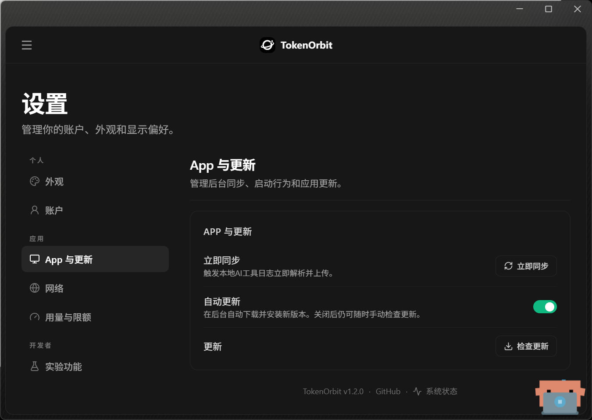

# TokenOrbit 显示品牌改名验证报告

## 范围与来源

- 仓库：`baozibao728-cmd/TokenTracker-Community`；Draft PR [#9](https://github.com/baozibao728-cmd/TokenTracker-Community/pull/9)，分支 `codex/tokenorbit-brand-name`。
- 首个源码候选：`f2da94ddfa9dc4f0bdf1211fecbe7cb220671473`，从 `main` 的 `1124177d7f0b8b1848748a023f75aeaa578a2c55` 开始。
- 当前修正后的固定源码候选：`04842178b611f52c3a6180fbd27b089e0737bccf`。本报告记录源码证据时以此 SHA 为准；报告自身后续提交 HEAD 另记，不能替代源码 SHA。
- 目标是将面向用户的产品显示名改为 **TokenOrbit**。不改版本（仍为 `1.2.0`）、既有技术身份、后端身份或图标造型。macOS 更新器增加了按既有 bundle 身份选择安装路径的兼容策略，详见下文；它不改变更新源、仓库、版本或发布资产身份。
- 原八文件下载回核与本机覆盖安装已完成；安装前备份不可覆盖，账户和数据在安装前后逐字节一致，云同步仍关闭。Windows 显示名定向实机验收 **PASS**，截图与证据边界见下文；macOS/Linux GUI/RUNTIME 仍为 **NOT_TESTED**。

## 显示名与保留身份

| 层 | 改名后的显示 | 保留的身份 / 契约 |
|---|---|---|
| 产品显示名 | TokenOrbit；Widget 显示为 TokenOrbit Widgets | 社区发行版仍属于 TokenTracker Community 仓库；README、展示文案、页面标题和平台菜单同步改显示名 |
| macOS 应用 | `TokenOrbit.app`；widget 显示名为 TokenOrbit Widgets | 主 app bundle ID `com.tokentracker.community`、widget bundle ID `com.tokentracker.community.widget`、主可执行文件 `TokenTracker Community`、scheme `tokentracker-community` 保留 |
| Windows | 文件属性、窗口标题、托盘产品提示及安装器显示 TokenOrbit；通用菜单命令保持 | exe `TokenTrackerCommunity.exe`、Inno AppId `{638F4DBF-F2B4-4408-B654-5A5D0F5B7AC7}`、每用户安装目录、协议 scheme `tokentracker-community`、发布文件名和 updater 下载身份保留 |
| Linux | 窗口、托盘与 `.desktop` 的 `Name` 显示 TokenOrbit | Tauri `productName` 仍为 `TokenTracker Community`；x86_64 程序名、包身份、协议及运行时目录保留 |
| 运行时和服务 | 用户可见提示使用 TokenOrbit | 内嵌 Node / .NET runtime、Community backend/client config、版本、协议、数据目录、更新源与发布资产身份保留；没有改后端或图标资源/几何 |

Linux 的 Tauri `productName` 必须维持 `TokenTracker Community`，因为 Tauri 将资源放在 `usr/lib/<productName>`。AppImage、deb、rpm 解包检查分别要求存在可执行的 `usr/lib/TokenTracker Community/EmbeddedServer/node`；RC 脚本还会从实际包内找到 Node 并校验 runtime。launcher 的 `Name=TokenOrbit` 与这个内部目录名是两项独立契约。

## 改动文件清单

以下是固定源码候选相对基线 `main` 的 87 个受跟踪文件。报告收尾另外修正 Windows README 标题与 CLAUDE.md 的本地 DMG 路径说明，仅为文档变化；报告和截图不计入源码清单。

```text
.github/workflows/ci.yml
.github/workflows/release-dmg.yml
CLAUDE.md
README.de.md
README.ja.md
README.ko.md
README.md
README.zh-CN.md
TokenTrackerBar/TokenTrackerBar/Info.plist
TokenTrackerBar/TokenTrackerBar/Models/AppInstallDestinationPolicy.swift
TokenTrackerBar/TokenTrackerBar/Services/DashboardWindowController.swift
TokenTrackerBar/TokenTrackerBar/Services/StatusBarController.swift
TokenTrackerBar/TokenTrackerBar/Services/UpdateChecker.swift
TokenTrackerBar/TokenTrackerBar/Utilities/Strings.swift
TokenTrackerBar/TokenTrackerBar/Views/DynamicIslandView.swift
TokenTrackerBar/TokenTrackerBarTests/AppInstallDestinationPolicyTests.swift
TokenTrackerBar/TokenTrackerWidget/Info.plist
TokenTrackerBar/project.yml
TokenTrackerBar/scripts/create-dmg.sh
TokenTrackerBar/scripts/generate_dmg_bg.swift
TokenTrackerBar/scripts/verify-community-identity.cjs
TokenTrackerLinux/README.md
TokenTrackerLinux/gnome-extension/tokentracker@tokentracker.cc/README.md
TokenTrackerLinux/gnome-extension/tokentracker@tokentracker.cc/extension.js
TokenTrackerLinux/gnome-extension/tokentracker@tokentracker.cc/metadata.json
TokenTrackerLinux/packaging/arch/tokentracker-linux/PKGBUILD
TokenTrackerLinux/packaging/arch/tokentracker-linux/tokentracker-linux.desktop
TokenTrackerLinux/scripts/bundle-node-linux.sh
TokenTrackerLinux/scripts/validate-package.sh
TokenTrackerLinux/src-tauri/Cargo.toml
TokenTrackerLinux/src-tauri/linux/tokentracker.desktop.hbs
TokenTrackerLinux/src-tauri/src/main.rs
TokenTrackerLinux/src-tauri/src/oauth.rs
TokenTrackerLinux/src-tauri/src/paths.rs
TokenTrackerLinux/src-tauri/src/server.rs
TokenTrackerLinux/src-tauri/src/tray.rs
TokenTrackerLinux/src-tauri/tests/oauth.rs
TokenTrackerLinux/src/index.html
TokenTrackerWin.Tests/WindowsReleaseIdentityTests.cs
TokenTrackerWin/Constants.cs
TokenTrackerWin/TokenTrackerWin.csproj
TokenTrackerWin/UrlProtocol.cs
TokenTrackerWin/installer/TokenTracker.iss
dashboard/index.html
dashboard/pet.html
dashboard/public/achievements/README.md
dashboard/public/feed.xml
dashboard/public/llms.txt
dashboard/quota.html
dashboard/share.html
dashboard/src/content/copy.csv
dashboard/src/content/i18n/de/core.json
dashboard/src/content/i18n/de/dashboard.json
dashboard/src/content/i18n/de/marketing.json
dashboard/src/content/i18n/ja/core.json
dashboard/src/content/i18n/ja/dashboard.json
dashboard/src/content/i18n/ja/marketing.json
dashboard/src/content/i18n/ko/core.json
dashboard/src/content/i18n/ko/dashboard.json
dashboard/src/content/i18n/ko/marketing.json
dashboard/src/content/i18n/zh-TW/core.json
dashboard/src/content/i18n/zh-TW/dashboard.json
dashboard/src/content/i18n/zh-TW/marketing.json
dashboard/src/content/i18n/zh/core.json
dashboard/src/content/i18n/zh/dashboard.json
dashboard/src/content/i18n/zh/marketing.json
dashboard/src/lib/copy.branding.test.ts
dashboard/src/pages/LeaderboardProfilePage.jsx
dashboard/src/ui/components/Shell.jsx
dashboard/src/ui/components/Shell.test.jsx
dashboard/src/ui/components/Sidebar.jsx
dashboard/src/ui/components/Sidebar.test.jsx
dashboard/src/ui/marketing/MarketingLanding.jsx
dashboard/src/ui/share/variants/AnnualReportCard.jsx
dashboard/src/ui/share/variants/BroadsheetCard.jsx
dashboard/vite.config.js
scripts/rc/linux.sh
scripts/rc/macos.sh
scripts/rc/verify-runtime.cjs
scripts/rc/verify-windows-shortcuts.ps1
scripts/rc/windows.ps1
test/discovery-metadata.test.js
test/linux-client-workflow.test.js
test/linux-health-monitor.test.js
test/release-dmg-workflow.test.js
test/tokenorbit-linux-name.test.js
test/tokenorbit-package-name.test.js
```

后续固定候选的两处最小修正是 `TokenTrackerLinux/src-tauri/src/tray.rs`（Rust 格式）和 `test/linux-health-monitor.test.js`（断言更新后的 “Open TokenOrbit Dashboard” 文案）。没有因此更改版本、身份或功能行为。

## 平台迁移与黑盒契约

### Windows owned shortcut

`scripts/rc/verify-windows-shortcuts.ps1` 在隔离的 GitHub Actions runner 上运行实际 Inno 安装器，并通过 Windows Shell 读 `.lnk` 的真实目标验证归属。测试预置一个官方名称 `TokenTracker.lnk` 保护样本、两个旧名 shortcut 和受控外部目标：

- 旧 `TokenTracker Community.lnk` 只有在目标精确指向本次 Community 安装的 `TokenTrackerCommunity.exe` 时才算本产品拥有；安装后应由 Inno 建立的 `TokenOrbit.lnk` 接管，旧链接移除。
- 即使桌面任务未勾选，已迁移的 owned 桌面链接也由 `[Icons]` 创建并纳入卸载日志；执行实际卸载后，两处新名链接都应移除。
- 再用指向外部受控目标的同名旧链接复测时，旧链接应保持原字节；未勾选桌面任务时不应新建桌面 TokenOrbit 链接。官方 `TokenTracker.lnk` 的 hash 应保持不变。
- 安装器使用静默参数且不启动 app。此处是 CI 安装器与 shortcut 的黑盒契约，不代表 Windows GUI、运行时或真实用户目录升级验收。

修正后的固定候选 RC [37726143381](https://github.com/baozibao728-cmd/TokenTracker-Community/actions/runs/37726143381) 中 Windows job **PASS**，实际执行 owned migration、卸载清理、foreign target 和官方名保护样本检查，再分别核对 ZIP/Setup 的完整一致 payload。此结论属于 `04842178…`，不是沿用首个候选的结果。

### macOS 旧安装路径

`AppInstallDestinationPolicy` 让更新器按 bundle ID `com.tokentracker.community` 识别旧安装：当前 `TokenOrbit.app` 已是本产品时优先原位替换；否则只有同 bundle ID 且为真实目录的 `TokenTracker Community.app` 才作为旧路径原位升级；没有 owned bundle 时使用新 `TokenOrbit.app` 路径。旧路径上的 foreign bundle 或 symlink 保留；新路径若被 foreign bundle 或 symlink 占用则拒绝替换。

新增 `AppInstallDestinationPolicyTests.swift` 的 8 个 XCTest 覆盖旧 owned bundle、全新安装、foreign/symlink（含 broken symlink）旧路径、当前路径优先级及新路径冲突。固定候选的普通 CI macOS job 实际运行 **8/8 PASS**。该策略只处理本地 app 落点兼容性，不验证完整更新下载、签名或 GUI 流程。

### Linux 内部目录

三个 Linux 包分别验证实际 payload 中的 `TokenTracker Community/EmbeddedServer/node`，再从解包根目录动态定位 Node 并执行 runtime 检查。窗口、托盘和 desktop entry 显示 TokenOrbit；Tauri `productName`、包身份和运行时目录保持旧值。固定候选的 AppImage、deb、rpm 分别 **BUILD/PACKAGE PASS**，不是用一个格式代替另外两个。

## 已完成的本地验证

- 定向资源、发布和 identity 检查：109 项 PASS。
- 后续 name/runtime 定向检查：12 项 PASS；与前述集合有重复，不能相加为 121 项。
- 前端 6 个文件：38 项 PASS。新增 copy/Shell 检查复验 7 项 PASS；与上述前端集合有重叠，不重复累计。
- typecheck、dashboard build、copy/locale/UI hardcode、architecture guardrails、version 与 icon consistency 检查均 PASS。
- 初次 dashboard build 因缺少环境配置被 guard 拦截；第二次遇到 Windows `EBUSY`；使用合法本地配置重试成功。前两次不计产品失败，敏感值未写入本报告。
- 不代表完整全量回归或平台原生验收；没有为此重跑完整测试套件。

## CI 与正式产物状态

| 候选 / 运行 | 已知状态 | 证据边界 |
|---|---|---|
| 首个源码 SHA `f2da94dd…`，普通 CI [37725718300](https://github.com/baozibao728-cmd/TokenTracker-Community/actions/runs/37725718300) | Node 与 macOS 因 `linux-health-monitor` 仍断言旧 “Open Dashboard” 文案而失败；Linux 因 `tray.rs` 格式检查失败；Windows .NET 8 PASS | 这是首个候选结果，不是当前固定候选结果 |
| 首个源码 SHA，build-only RC [37725718312](https://github.com/baozibao728-cmd/TokenTracker-Community/actions/runs/37725718312) | Windows PASS；其余平台任务被后续 push 取代，未完成 | 不得写成三平台 RC PASS |
| 固定源码 SHA `04842178…`，普通 CI [37726143349](https://github.com/baozibao728-cmd/TokenTracker-Community/actions/runs/37726143349) | **4/4 PASS** | Windows .NET 8、Linux Rust、Node validation/build、macOS unit 全部成功；PR 合并 checkout 为 `aee6494ef7c29632dc6e8e22a8c1cfaaa136f927` |
| 固定源码 SHA，build-only RC [37726143381](https://github.com/baozibao728-cmd/TokenTracker-Community/actions/runs/37726143381) | **三平台 BUILD/PACKAGE + delivery PASS** | 每个 job 显式 checkout `04842178b611f52c3a6180fbd27b089e0737bccf`；六包的实际字节校验成功 |
| 最终 RC artifact | **8/8 下载回核 PASS** | artifact `11527574101`；下表为实际包字节与两个原始元数据文件自身摘要 |
| 收尾文档与截图 | 后续纯文档提交 | 最终 PR HEAD 与该提交 CI 在 PR 摘要记录，不循环追加本文自身 SHA；包和原生证据仍归属固定源码 `04842178…` |

原八文件下载回核 **8/8 PASS**。交付 [artifact 11527574101](https://github.com/baozibao728-cmd/TokenTracker-Community/actions/runs/37726143381/artifacts/11527574101)，外层 ZIP 大小 499,047,277 bytes，SHA-256 `bf2b6de748bb51a60540c326068554770ea0de397629c816cfc0070d39e222b4`，与 GitHub artifact digest 完全一致。外层 ZIP 解压后恰好八个文件；六包与原 manifest/SHA256SUMS 逐一核对，两个元数据文件自身摘要也保留如下，没有重写、重新签名或重压缩。manifest version=`1.2.0`，source_sha=checkout_sha=`04842178b611f52c3a6180fbd27b089e0737bccf`。

| 原始文件 | Bytes | SHA-256 |
|---|---:|---|
| `RC_MANIFEST.json` | 1598 | `0d295d89bc3fd5ad35438aefcd6b2a3189a0be7cab02a507226add45692cebdc` |
| `SHA256SUMS` | 615 | `913c43f8938d2ac8a660dc3b17872e7a6b1bb3a0971db5ae63cda0a3c3a1f8b8` |
| `TokenTracker-Community-linux-x86_64.AppImage` | 127465976 | `8616fee6aa341f7e87b42117ded5ba02f28effb81f6674d048d168ca6c81793f` |
| `TokenTracker-Community-linux-x86_64.deb` | 56978500 | `638a1ac679703af9bb59ff6f1bb60e8d1a639e5a6ebb5327883feebe43fa398b` |
| `TokenTracker-Community-linux-x86_64.rpm` | 56953255 | `42d5a031ecd63dc46f399ebf7588f2fd30706d796a9b029fe013dcda018d6013` |
| `TokenTracker-Community-Setup.exe` | 80795557 | `30933f453897588267ef85a569071ce6d7c3e656b3143138212803b1c9f90d26` |
| `TokenTracker-Community-win-x64.zip` | 114957780 | `c177df3ce46cc28f5422b13316ccaebc4ff22d41c80d9cb2d437eac7e40f4915` |
| `TokenTrackerCommunity.dmg` | 61892760 | `4c47602f834e88ed970856b66765d12572c91c716e79df9d2eb2c11881c81105` |

## Windows 原包覆盖安装与定向实机验收

本轮使用上表已下载回核的 **原 Setup.exe**，完整 SHA-256 为 `30933f453897588267ef85a569071ce6d7c3e656b3143138212803b1c9f90d26`。没有重新构建、重压缩、重新签名或替换包；包内版本为 `1.2.0`，Windows 文件版本来源为 `1.2.0+04842178b611f52c3a6180fbd27b089e0737bccf`。

### 备份、安装和身份

- 用户从托盘正常退出后，保存不可覆盖的 Community 安装、原生数据和 CLI 数据备份，并限制为当前用户访问。安装前文件清单快照 SHA-256 为 `a122afc60bb2d379ee5a427d6ab5b2aeb33104f4d9538a494d73da5b0d3df86e`。备份与安全快照留在本机忽略目录，未提交数据或凭据。恢复路径是在应用停止后恢复本产品对应目录；本轮未执行恢复，也未触碰官方版目录。
- 原安装器同版本覆盖安装返回 exit code **0**。启动应用之前逐文件对照：Community 原生目录 **1245/1245**、CLI 数据 **20/20** 文件内容和数量全部相同，无增加、删除或内容变化。此结论属于安装前后快照；应用后续正常采集、日志和 WebView 活动不在“逐字节不变”的声明范围内。
- 实际安装内容 **945 个 payload 文件**与该候选原 portable ZIP 对应字节一致。主进程来自既有 Community 安装目录的 `TokenTrackerCommunity.exe`，Node 为同目录下 `EmbeddedServer/node.exe`，且 Node 父进程为本产品主进程。本地服务健康检查 **HTTP 200**。
- Windows ProductName 和唯一卸载登记 DisplayName 均为 **TokenOrbit**，本产品卸载入口数量为 **1**；AppId、安装目录和内部 exe 名不变。
- 开始菜单与桌面各有一个 `TokenOrbit.lnk`，两者实际目标均为本次安装 exe。此前两个 owned `TokenTracker Community.lnk` 已迁移移除，没有留下重复 Community 入口。官方 `TokenTracker.lnk` 保持原字节。

### 官方版保护与云同步

| 安装前 → 安装后、启动前 | 对照结果 |
|---|---|
| 官方版安装文件 1760/1760 | 内容、数量均不变 |
| 官方版原生数据 1407/1407、CLI 数据 1527/1527 | 内容、数量均不变 |
| 官方协议 3 项、卸载登记 24 项 | hash 不变 |
| 两个受保护工具配置文件、官方快捷方式 | hash 不变 |
| Community 账户/配置及云同步偏好 | 安装前后文件不变；云同步为 OFF |

用户在本候选原生 WebView 中确认“**一切正常**”，对应请求明确包含仍已登录、云同步仍关闭及新产品名。2026-10-09 再次从既有托盘打开同一安装版补拍品牌截图，实际窗口标题为 **TokenOrbit**，文档标题为 **TokenOrbit — AI Token Usage & Cost Tracker for Coding CLIs**，设置页显示 **TokenOrbit v1.2.0**；未重新登录、未清缓存、未调整同步开关。宠物显示仍保持原设计。

安全观察只记录事件、HTTP method/host/path，去掉 query/fragment，不采集认证 header、请求正文或凭据。2026-10-08 04:47:12–17:12:20 UTC 的已观察记录共 **1582 条**，其中 ingest 请求 **0**；实际 Auth refresh 目标为自有 `tc79bxhm.ap-southeast.insforge.app`。该观察覆盖指定运行进程和时间窗口，不延伸为全天或后续所有进程的网络证明。被动 WebView 观察另确认 `cloudSyncDisabled=true`；首次等待窗口的观察器超时属于观察准备失败，不是产品故障。用户中断观察后已停止，恢复工作未重跑登录或 Community 生命周期。

云端仅执行自有项目的固定只读查询：pre 为 `2026-10-08T04:18:31.321Z`，post 为 `2026-10-09T11:31:08.814Z`，均 **HTTP 200**。两次均为 Auth 用户 **2**、hourly **1 行**、`total_tokens="130"`、Community 三表 **0/0/0**；hourly row-content fingerprint 均为 `dad542fc78704f5f54220ca7e30850f3`。没有新增 Token 样本、社区或账号，没有修改云端资源。

### 实际截图

以下均来自固定源码 `04842178…` 的本轮 Windows 安装包；前两张为实际 shortcut 属性，应用页头图由用户在原生窗口截取，未用开发页或重新绘制图片代替。

| 证据 | 内容 |
|---|---|
| [开始菜单快捷方式](tokenorbit-brand-name-windows/start-menu-shortcut.png) | TokenOrbit 名称、圆环图标及保留的内部 exe 目标 |
| [桌面快捷方式](tokenorbit-brand-name-windows/desktop-shortcut.png) | TokenOrbit 名称及新图标；内部 exe 描述保留旧技术身份 |
| [原生设置与版本](tokenorbit-brand-name-windows/app-settings.png) | 真实安装版设置页的 TokenOrbit v1.2.0 |
| [窄窗口产品页头](tokenorbit-brand-name-windows/app-header.png) | 圆环图标 + TokenOrbit、设置页版本及原宠物 |



Windows 本轮覆盖安装、名称及账户/数据保留的定向验收 **PASS**。没有据此宣称完整更高版本 updater 链通过。macOS/Linux 包内容检查和正式构建 **PASS**，但对应桌面安装、窗口/菜单、Widget 与实际运行 **GUI/RUNTIME NOT_TESTED**；macOS 新安装路径策略的 XCTest 不代替 GUI 升级验收。

## 持续保留的限制

Windows 包未签名；macOS 使用 ad-hoc signature，不等于 Developer ID / notarization。macOS/Linux GUI 和 runtime 未测试。真实 WSL、完整下载与更高版本 updater 链、旧 metadata 迁移未测试；已有配置差异缺少写入者证据，仍未归因。既有 Dashboard 两个基线失败及 macOS notify 限制保持原报告结论。本次未重跑这些流程，也不把旧报告结果改写成本候选结果。参见 [Windows 组合 RC 验收记录](windows-combined-rc-acceptance.md) 与 [品牌图标验证记录](brand-icon-validation.md)。

本轮源码、固定包和 Windows 定向实机证据已具备交 review 条件，Draft PR 保持未合并。收尾只补报告、截图、Windows README 标题和本地 DMG 文档命令，最终文档 HEAD/普通 CI 在 PR 摘要记录。现有 RC 触发规则会把 `TokenTrackerWin/README.md` 计入平台路径，因此文档 push 可能自动产生另一轮 build-only 运行；该运行不替代已验收的 `04842178…` 包，不重新安装或改写产物来源。未手动 dispatch 发布或重复打包流程，十个继承工作流继续禁用。

**READY FOR REVIEW；稳定版仍 NOT_READY。** 未合并、未改版本，未创建 tag/Release，未改公开预览资产或云端。
